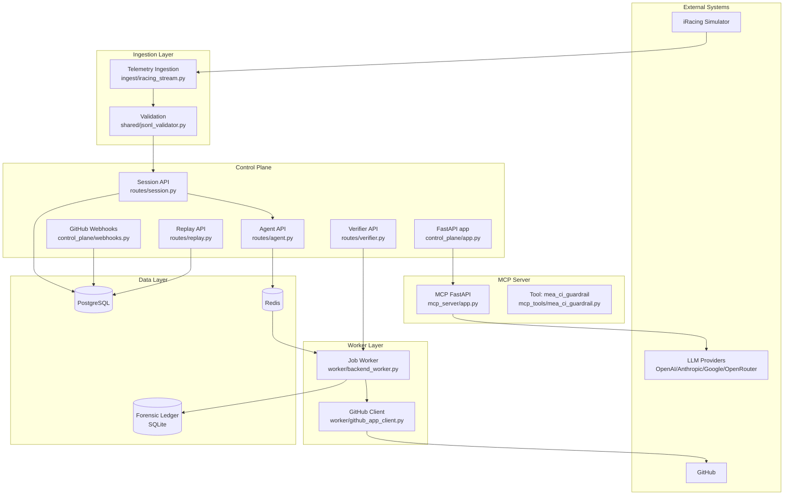

# Motorsport Engineering Agent (MEA) Comprehensive Review Report

## Executive Summary

The Motorsport Engineering Agent (MEA) is a purpose-built system that integrates AI decision-making, telemetry ingestion, and software delivery workflows for motorsport engineering operations. It combines live and replay telemetry from iRacing with a FastAPI-based control plane, a worker backend, an MCP server for AI tool orchestration, and GitHub integration to automate evidence-driven recommendations, CI fixes, and engineering workflows.

MEA is designed to ingest racing telemetry, validate and store evidence, generate AI-driven recommendations, queue and execute jobs, and maintain a tamper-evident audit trail through a forensic ledger. The system prioritizes modularity, asynchronous processing, and secure integrations with GitHub and external LLM providers.

## Architecture Overview

### System Layers

- **Ingestion Layer**: Receives telemetry data from iRacing, validates JSONL artifacts, and produces evidence packets.
- **Control Plane**: FastAPI application managing API routes, session persistence, job lifecycle, replay capabilities, and webhook handling.
- **Worker Layer**: Background job processor executing queued work, applying CI fixes, and coordinating GitHub interactions.
- **MCP Server**: Model Context Protocol server exposing LLM provider metadata, tool execution, and scaffolded agent-to-agent (A2A) invocations.
- **Data Layer**: PostgreSQL for structured data, Redis for job queueing, and SQLite for audit ledger storage.

### Architecture Diagram

## Component Descriptions and Responsibilities

### `control_plane/app.py`
- Hosts the central FastAPI application.
- Includes routers for agent decisions, sessions, replay, verification, and GitHub webhooks.
- Exposes health check and job status endpoints.

### `control_plane/routes/agent.py`
- Handles `POST /agent/decision` requests.
- Queues AI decision work through `supervisor_service`.
- Records forensic receipts for auditability.

### `control_plane/routes/session.py`
- Handles session evidence ingestion and ledger replay.
- Persists session evidence and recommendations.
- Provides session audit and replay endpoints.

### `control_plane/routes/replay.py`
- Replays stored session artifacts and validates deterministic outputs.
- Supports replay of evidence and ledger state.

### `control_plane/routes/verifier.py`
- Executes verification jobs through `job_runner`.
- Tracks job phases and returns structured results.

### `control_plane/webhooks.py`
- Accepts GitHub webhook events.
- Verifies signature integrity using HMAC SHA256.
- Stores webhook events and correlates workflow runs.

### `control_plane/queue.py`
- Implements job enqueue/dequeue behavior.
- Supports Redis-backed queue with in-memory fallback.
- Enables asynchronous processing across service boundaries.

### `control_plane/repository.py`
- Encapsulates database persistence for jobs, traces, sessions, webhook events, and evidence.
- Updates job status, retrieves trace logs, and performs replay validation.

### `worker/backend_worker.py`
- Processes queued jobs from Redis.
- Executes decision workflows, GitHub operations, and CI guardrail checks.
- Writes job outcomes and audit receipts.

### `worker/github_app_client.py`
- Authenticates as a GitHub App using JWT.
- Requests installation tokens and interacts with repository APIs.
- Supports PR creation, reviews, and workflow status correlation.

### `mcp_server/app.py`
- Serves the MCP interface for LLM provider metadata and tool invocation.
- Secures sensitive endpoints with bearer tokens.
- Provides scaffolding for future provider integrations.

### `mcp_tools/mea_ci_guardrail.py`
- Validates proposed code patches prior to execution.
- Prevents unsafe or overly large patch application.
- Returns structured safety recommendations.

### `ingest/iracing_stream.py`
- Reads live or archived iRacing telemetry streams.
- Converts simulator frames into evidence packets.
- Interfaces with JSONL validation and sampling logic.

### `shared/jsonl_validator.py`
- Validates JSONL telemetry artifacts.
- Ensures schema compliance, monotonic timestamps/ticks, and field completeness.

### `shared/forensic_ledger.py`
- Maintains an immutable audit ledger.
- Creates verifiable receipts for each decision and job event.
- Supports replay and chain integrity validation.

### `shared/models.py`
- Defines telemetry, session, and evidence data models.
- Serves as schema source for API validation and persistence.

## Key Workflows Documented

### Telemetry Ingestion Workflow
1. `iRacing Simulator` emits telemetry frames.
2. `ingest/iracing_stream.py` ingests frames and applies schema validation.
3. Validated evidence is persisted through session APIs.
4. Evidence packets are stored in PostgreSQL and used for recommendation generation.

### Evidence-to-Recommendation Workflow
1. Session evidence is ingested via `POST /session/evidence`.
2. `shared/jsonl_validator.py` validates packet format and timestamps.
3. Recommendations are produced by the supervisor policy engine.
4. Recommendations are stored in `recommendations_runtime` and made available for decision requests.

### Decision Processing Workflow
1. Client posts a decision request to `POST /agent/decision`.
2. Request is validated and forwarded to `supervisor_service`.
3. Job metadata is recorded in PostgreSQL.
4. Job is queued in Redis.
5. Worker dequeues and processes the job.
6. Results are logged to the forensic ledger and returned on completion.

### Worker Execution and GitHub Integration Workflow
1. Worker obtains a queued job from Redis.
2. `worker/backend_worker.py` performs the requested action.
3. `worker/github_app_client.py` authenticates to GitHub and executes repository operations.
4. GitHub webhook callbacks are stored and correlated with job lifecycle.
5. Execution traces and receipts are persisted.

### MCP Tool Invocation Workflow
1. MCP client requests `/tools/call` with bearer token.
2. `mea_ci_guardrail` evaluates patch safety.
3. Tool returns safety assessment and recommended next step.
4. This outcome informs downstream decision or patch application.

## Technology Assessment

### Core Stack
- **Python**: Primary language, with requirement `>=3.11` and confirmed compatibility with `3.13.7`.
- **FastAPI**: Web framework for the control plane and MCP server.
- **Uvicorn**: ASGI server for production and local development.
- **Pydantic**: Data validation and schema enforcement.
- **PostgreSQL**: Structured persistence for jobs, sessions, evidence, and metadata.
- **Redis**: Asynchronous job queue and caching layer.
- **SQLite**: Forensic ledger persistence and audit trail storage.

### External Integrations
- **GitHub API**: GitHub App authentication, webhook processing, repository management.
- **LLM Providers**: OpenAI, Anthropic, Google, OpenRouter via MCP server scaffold.
- **iRacing**: Telemetry input source and simulator integration.

### Infrastructure and Deployment
- **Docker / Docker Compose**: Containerized deployment for control plane, worker, and MCP server.
- **Makefile**: Build and run automation.
- **CI/CD Guardrails**: `mea_ci_guardrail` and policy checks to reduce unsafe patch application.

### Security and Compliance
- **Authentication**: JWT for GitHub App, bearer token for MCP server.
- **Webhook Security**: HMAC SHA256 verification for incoming GitHub events.
- **Input Validation**: Strong Pydantic models protect API surfaces.
- **Auditability**: Forensic ledger maintains verifiable record of decision and job events.

### Observability and Quality
- **Health Checks**: `GET /healthz` endpoints across services.
- **Traceability**: Job traces and auditor receipts stored with each workflow.
- **Testing**: Pytest coverage for unit and integration tests, with explicit validation utilities.

## Recommendations for Improvement

- Implement real LLM provider transports in the MCP server to replace the scaffolded A2A invoke behavior.
- Expand tooling beyond `mea_ci_guardrail` to support richer automated reasoning and safety checks.
- Add end-to-end integration tests for control plane, worker, MCP server, and GitHub workflows.
- Enhance retry and circuit-breaking semantics for external dependencies like GitHub, Redis, and LLM providers.
- Document deployment and operational runbooks for production readiness, including monitoring and alerting.

## Security Considerations

- Ensure all external endpoints use HTTPS in production.
- Protect environment secrets for GitHub App keys and LLM provider API keys.
- Harden webhook handling to reject invalid or replayed payloads.
- Maintain audit ledger integrity through secure storage and periodic verification.
- Apply least-privilege access for GitHub App installations and database credentials.
- Validate all telemetry input aggressively to avoid malformed or malicious data.

## Conclusion

The Motorsport Engineering Agent is a coherent system that bridges motorsport telemetry, AI reasoning, and software delivery workflows. Its architecture supports asynchronous, auditable decision-making, with strong foundations in FastAPI, Postgres, Redis, and containerization. Completing production-ready LLM integration, broadening tool coverage, and strengthening operational documentation will further mature the platform.
