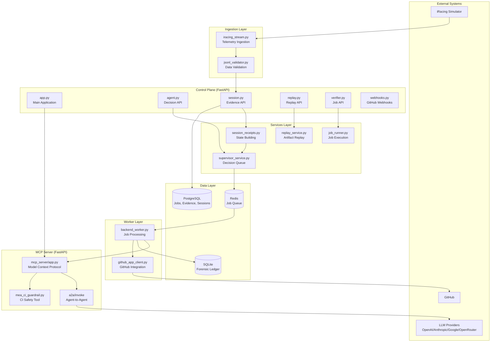

# Data Flow and Architecture Documentation

## Overview
This document provides a comprehensive mapping of the end-to-end data flow and architectural components of the Motorsport Engineering Agent (MEA) system. It synthesizes findings from individual component analyses to illustrate how telemetry data flows from ingestion through processing to AI-driven decisions.

## End-to-End Data Flow

### High-Level Data Flow: Telemetry → Processing → Decisions

```
iRacing Simulator → Telemetry Ingestion → Evidence Processing → AI Analysis → Decision Queue → Worker Execution → GitHub Integration
```

### Detailed Data Flow Stages

1. **Telemetry Ingestion (iRacing Stream)**
   - Source: iRacing simulator data streams
   - Format: JSONL telemetry frames
   - Components: `ingest/iracing_stream.py`
   - Validation: JSONL schema validation, timestamp/tick monotonicity
   - Storage: PostgreSQL `session_evidence` table

2. **Evidence Processing**
   - Input: Validated telemetry frames
   - Processing: Feature extraction (brake_delta, turn_in_delta, etc.)
   - Output: Evidence packets with severity levels (CRITICAL, WARNING, ADVISORY, INFO, NONE)
   - Storage: `evidence_packets` table with JSONB features

3. **AI Analysis and Recommendations**
   - Input: Evidence packets
   - Engine: Supervisor loop with policy engine
   - Components: `mea/reasoning/policy_engine.py`, time domains
   - Output: Prioritized recommendations with TTL and cooldown logic
   - Storage: `recommendations_runtime` table

4. **Decision Queue and Processing**
   - Queue: Redis-backed job queue with in-memory fallback
   - Components: `control_plane/queue.py`, `worker/backend_worker.py`
   - Processing: Asynchronous job execution with phases
   - Audit: Forensic ledger receipts for all decisions

5. **Worker Execution and GitHub Integration**
   - Execution: `worker/backend_worker.py` processes queued jobs
   - Integration: GitHub App client for PR creation, reviews, merges
   - Validation: CI guardrails via MCP server tools
   - Output: Code patches, PRs, workflow correlations

## Component Interaction Diagram



## API Communication Patterns

### REST API Endpoints (Control Plane - Port 8000)

#### Agent Decision API
- **POST /agent/decision**
  - Input: Evidence-bound decision request
  - Process: Queue via supervisor service, log forensic receipts
  - Output: Decision response with audit trail

#### Session Management API
- **POST /session/evidence**
  - Input: Evidence packet batches
  - Process: Store evidence, generate recommendations
  - Output: Evidence response
- **GET /session/{session_id}/replay-ledger**
  - Input: Session ID
  - Process: Verify chain integrity
  - Output: Ledger replay results

#### Job Management API
- **POST /verifier/execute**
  - Input: Job execution request
  - Process: Run via job runner, append receipts
  - Output: Execution results
- **GET /jobs/{job_id}**
  - Input: Job ID
  - Process: Query job status
  - Output: Job status response
- **GET /jobs/{job_id}/trace**
  - Input: Job ID
  - Process: Retrieve execution trace
  - Output: Trace data

#### GitHub Integration API
- **POST /github/webhook**
  - Input: GitHub webhook payload
  - Process: Verify HMAC, store events, correlate workflows
  - Output: Webhook processing confirmation

### MCP Server API (Port 8001)
- **GET /healthz**: Health check
- **GET /providers**: LLM provider status
- **POST /tools/call**: Execute tools (authenticated)
- **POST /a2a/invoke**: Agent-to-agent invocations (authenticated)

### Communication Patterns
- **Synchronous**: Health checks, status queries
- **Asynchronous**: Job queuing via Redis
- **Event-Driven**: GitHub webhooks
- **Authenticated**: Bearer token for MCP server
- **Audited**: All decisions logged to forensic ledger

## Job Lifecycle

### Job Creation and Queueing
1. **Request**: API endpoint receives job request (e.g., agent decision, CI fix)
2. **Validation**: Input validated via Pydantic models
3. **Queueing**: Job added to Redis queue with metadata
4. **Receipt**: Intent logged to forensic ledger

### Job Processing
1. **Dequeue**: Worker picks job from Redis queue
2. **Execution**: Job processed by backend_worker.py
3. **Phases**: Job status updated through phases (queued → processing → completed/failed)
4. **Integration**: GitHub operations performed via github_app_client.py
5. **Validation**: CI guardrails checked via MCP server tools

### Job Completion
1. **Result Logging**: Completion logged to forensic ledger
2. **Status Update**: Job status persisted to database
3. **Notification**: Webhook events correlated with job completion
4. **Cleanup**: Resources released, traces stored

### Error Handling
- **Timeouts**: Jobs can timeout based on configuration
- **Retries**: Failed jobs may be retried
- **Logging**: All errors logged with full context
- **Recovery**: Forensic ledger enables state reconstruction

## External Integrations

### GitHub Integration
- **Authentication**: JWT-based GitHub App authentication
- **Operations**: PR creation, reviews, merges, status checks
- **Webhooks**: Event-driven processing of GitHub events
- **Correlation**: Workflow runs linked to MEA jobs
- **Security**: HMAC signature verification for webhooks

### iRacing Telemetry
- **Data Source**: Live simulator telemetry streams
- **Format**: JSONL with telemetry frames
- **Validation**: Schema validation and monotonicity checks
- **Features**: Brake delta, turn-in delta, throttle position, etc.
- **Storage**: Time-domain aware (DATA vs WALL time)

### LLM Providers
- **Supported**: OpenAI, Anthropic, Google, OpenRouter
- **Interface**: MCP server provides unified API
- **Authentication**: Provider-specific API keys
- **Usage**: Agent-to-agent invocations, tool execution
- **Tools**: Currently `mea_ci_guardrail` for patch safety analysis

## Data Persistence Architecture

### Multi-Layer Storage
1. **PostgreSQL**: Structured data (jobs, evidence, sessions)
2. **SQLite**: Forensic ledger for immutable audit trails
3. **Redis**: Job queue and caching
4. **JSONL**: Raw telemetry data files

### Key Tables
- `jobs`: Job lifecycle management
- `evidence_packets`: Processed telemetry data
- `recommendations_runtime`: AI-generated recommendations
- `github_installations`: GitHub App data
- `webhook_events`: GitHub webhook storage
- `receipts`: Forensic audit trail

### Indexing Strategy
- Session-based indexing for efficient queries
- Timestamp indexing for time-range queries
- Hash-based verification for audit integrity

## Security and Audit Architecture

### Authentication
- **GitHub**: JWT tokens for App authentication
- **MCP Server**: Bearer token authentication
- **Webhooks**: HMAC SHA256 signature verification

### Audit Trail
- **Forensic Ledger**: Cryptographically verifiable receipts
- **Hash Chaining**: Tamper-evident state changes
- **Session Heads**: Current state tracking
- **Logical Clock**: Per-session monotonic ordering

### Validation
- **CI Guardrails**: Patch safety analysis before application
- **Schema Validation**: Pydantic models for all inputs
- **Monotonicity Checks**: Timestamp and tick validation

## Performance Characteristics

### Scalability
- **Asynchronous Processing**: Redis queue enables horizontal scaling
- **Database Indexing**: Optimized for session-based queries
- **TTL Management**: Recommendations expire to prevent accumulation

### Reliability
- **Error Recovery**: Forensic ledger enables state reconstruction
- **Health Checks**: Multiple endpoints for monitoring
- **Fallback Mechanisms**: In-memory queue fallback for Redis

### Monitoring
- **Traces**: Distributed tracing support
- **Metrics**: Performance tracking via spans
- **Logs**: Comprehensive logging throughout pipeline</content>
<parameter name="filePath">c:\Users\eqhsp\Agent Projects\MotorsportEngineerAgent\motorsport-engineering-agent\docs\data_flow_architecture.md