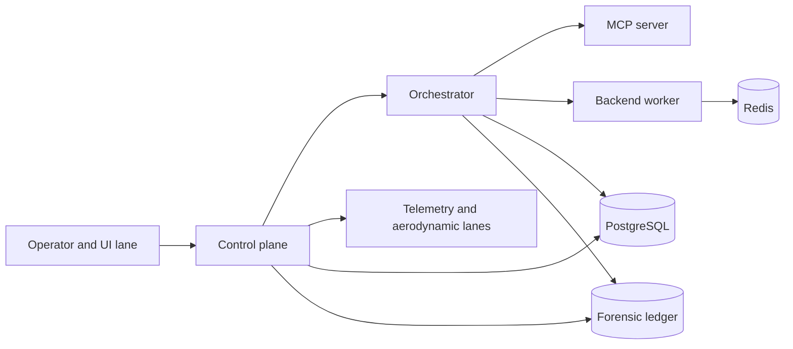

# MEA V3.8 System Architecture

## Purpose

MEA V3.8 separates platform responsibilities into bounded, auditable lanes. Runtime ownership is deterministic, public API compatibility is retained, and production telemetry carries the correlation identifiers required for incident analysis.

## Runtime topology

## Ownership boundaries

| Lane | Owner | Responsibilities |
| --- | --- | --- |
| UI | Operator interface | Authentication boundary, request submission, session control, and review. |
| Control plane | `control_plane/` | Public API routes, request validation, ingest, aerodynamic runs, and runtime state. |
| Orchestration | `services/orchestrator/` | Deterministic execution, commands, leases, handoffs, events, receipts, and checkpoints. |
| MCP | `mcp_server/` | Controlled tool/provider surface resolving through the canonical runtime registry. |
| Worker | `worker/` | Bounded asynchronous execution and policy-gated repository operations. |
| Data | PostgreSQL, Redis, and forensic ledger | Durable state, queueing, and chain-verifiable receipts. |
| Observability | Runtime event contract and reliability policy | Correlation by `run_id`, `agent_id`, and `lane`; SLO and error-budget measurement. |

## Contract authorities

`mcp.json` is the source of runtime agent metadata. `mcp_v1_runtime_bundle/tool-registry.json` is the source of orchestrator tool contracts. Runtime events validate against `contracts/runtime/agent_runtime_contract_bundle.schema.json`; governed skills validate against `contracts/skills/skill_contract.schema.json`.

## Security and recovery

The control plane enforces configured webhook and session-ledger validation. MCP calls can require bearer-token authentication. Patch work remains bounded by allowlists, size limits, and workflow-change policy. Production recovery procedures, error budgets, and rollback instructions are defined by `config/reliability/slo.yaml` and `docs/ops/V3_8_PRODUCTION_READINESS.md`.
