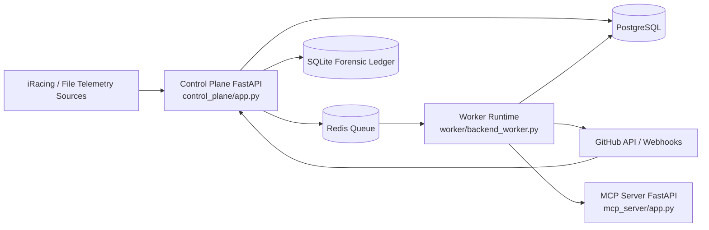

# System Architecture (v3.5)

## Purpose
This document defines the current system architecture baseline for the Motorsport Engineering Agent (MEA) and supersedes fragmented architecture notes across review artifacts.

## Runtime Topology

## Core Components

### 1. Control Plane
- Hosts the primary HTTP API surface.
- Registers routers for `agent`, `ingest`, `runtime_logs`, `session`, `replay`, `verifier`, and `webhooks`.
- Handles startup validation for webhook and session ledger configuration.
- Writes job state and session artifacts via repository functions.

### 2. Worker Backend
- Dequeues and processes asynchronous jobs.
- Enforces patch policy checks before execution.
- Clones repository targets, applies patches, runs tests, pushes fix branches, and opens PRs.
- Records phase transitions and spans for traceability.

### 3. MCP Server
- Exposes provider status and guarded tool execution.
- Enforces optional shared bearer token policy.
- Supplies `mea_ci_guardrail` and scaffolded `a2a/invoke` provider bridge endpoint.

### 4. Ingestion Layer
- Supports telemetry frame generation from iRacing streams.
- Normalizes and persists session evidence for downstream decision workflows.
- Serves as the data-entry boundary for telemetry-derived recommendations.

### 5. Data and Audit Layer
- PostgreSQL stores operational runtime state (jobs, traces, evidence).
- Redis backs async queueing with in-memory fallback behavior in queue code paths.
- SQLite forensic ledger provides immutable, chain-verifiable receipts.

## Job Lifecycle
1. API request creates a job record and queues work.
2. Worker dequeues and validates repo and patch constraints.
3. Worker executes clone -> patch -> test -> push -> PR flow.
4. Control plane and worker persist spans, phase transitions, and receipts.
5. Webhook events reconcile external GitHub workflow state to internal job traces.

## Security Boundaries
- Webhooks can be mandatory via `GITHUB_WEBHOOK_REQUIRED` and secret validation.
- MCP execution can require bearer token via `MCP_SHARED_BEARER_TOKEN`.
- Patch processing enforces repository allowlist, patch size limits, and workflow-edit policy guardrails.

## PRD Alignment
- `Task-002`: Control plane structure and route inventory.
- `Task-003`: MCP role, provider surface, and auth path.
- `Task-004`: Worker backend pipeline and GitHub integration.
- `Task-005`: Telemetry ingestion boundary.
- `Task-009`: End-to-end flow and interaction model.
